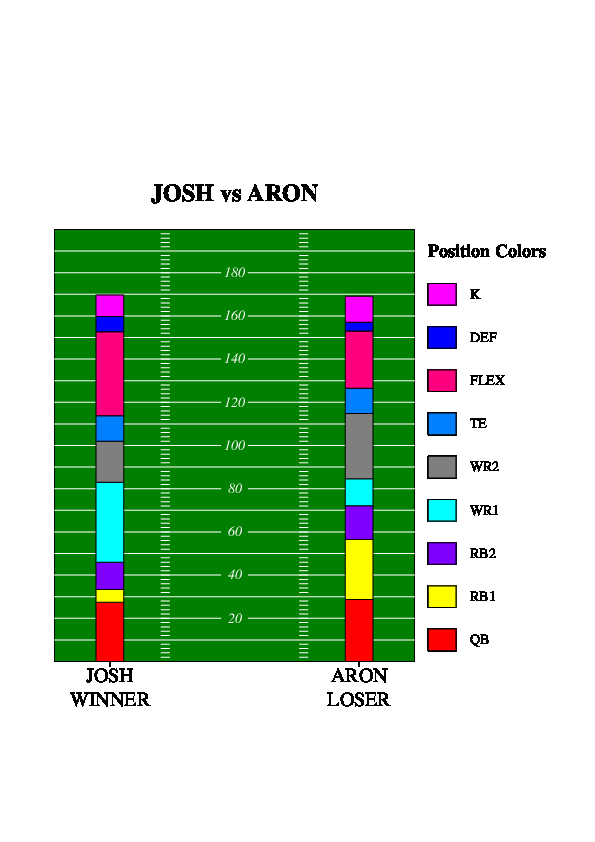
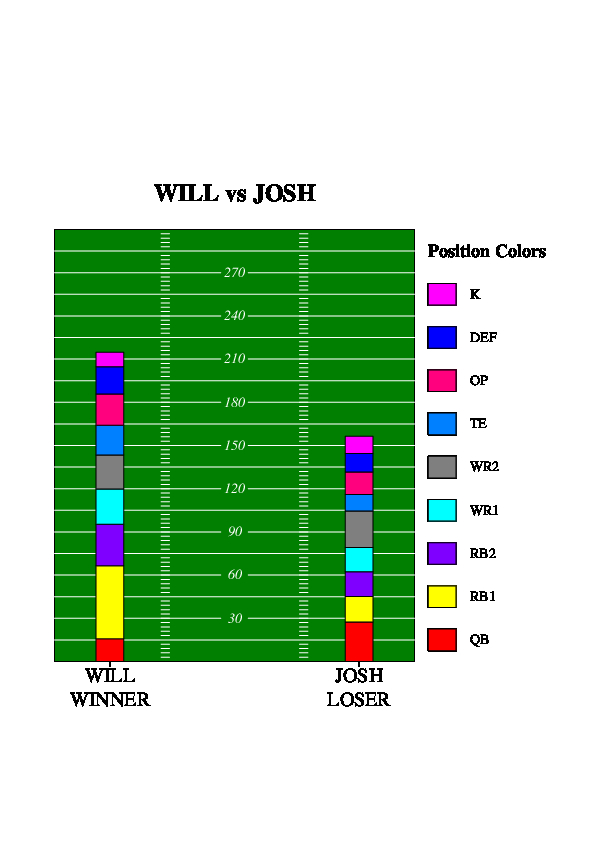
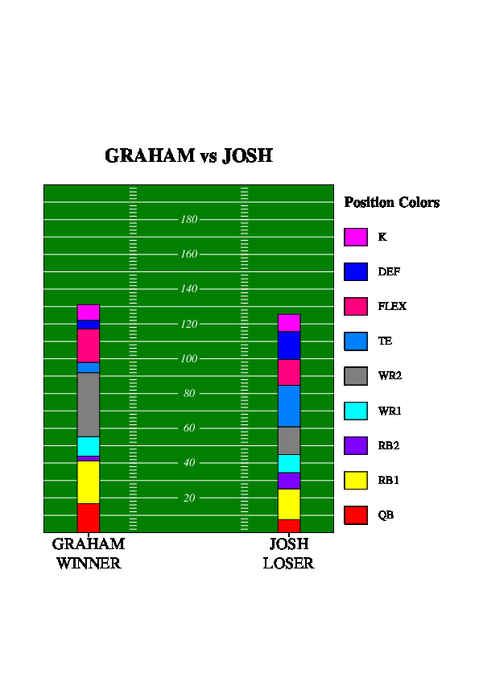
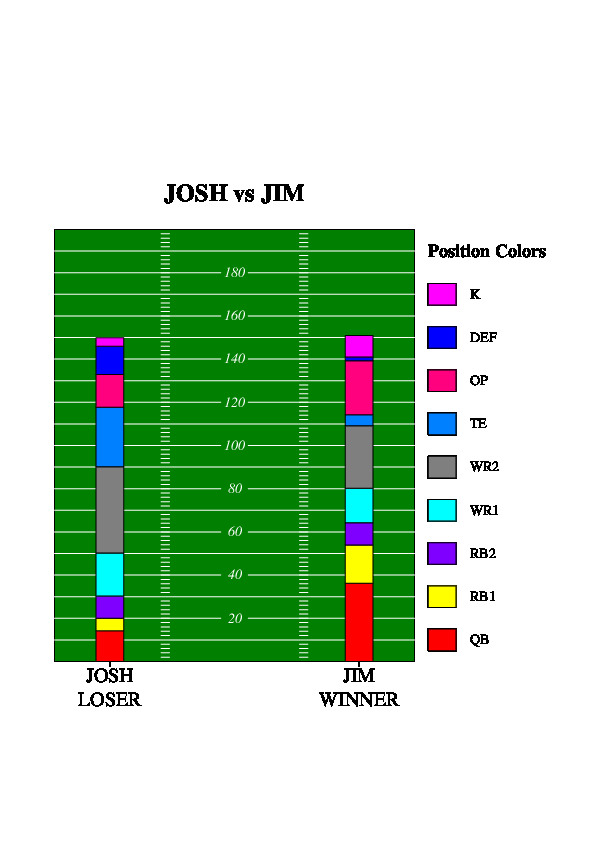

# Fantasy Football Score Visualizer

## Description
This project uses Dr. James Planks' graphing utility "jgraph" in order to create interesting visual output from a given text file. This project specifically takes a fantasy football matchup between two players containing the scores of each position as a text file, then represents the data as a bar graph overlayed over a football field (modified slightly from Dr. Plank's football field provided in lecture notes).

This output can easily and visually show you where your fantasy team succeeded or struggled in a weekly matchup, giving you insight as to what positions you should look to improve upon.

## Instructions to Run

Firstly, ensure that you have python installed (the version this was created with was 3.8.5, but others should work. If you have any issues with something acting strangely, ensure you use this version) Also ensure that you have ps2pdf installed, otherwise the shell scripts will not function properly. If you choose to create JPGs using the convert utility, you must ensure you have ImageMagick-6 installed, and you must change the policy.xml file in the ImageMagick directory to allow "read | write" permissions for pdf files.

Shell scripts have been provided for your convenience to run this program, so you have a few options.

1. `make`
 - This simply runs the next shell script, `auto.sh`

2. `sh auto.sh`
 - This program runs with no command line arguments, and will create a pdf for each of the 5 example text files provided in the examples directory. The output will be placed into files named ex*.pdf also located in the examples directory, respectively numbered by the text file it was created with.

3. `sh manual.sh [input file] [output file (no extension)]`
 - This program takes an input file, such as 'examples/ex1.txt' and an output file, such as 'output' as command line arguments. Simply provide both the input file and the desired name of the output file and view the results (as a pdf) in the output file you specified.

4. `python parse.py [input file] > temp.jgr`

     `./jgr/jgraph -P temp.jgr | ps2pdf - [output file name (with .pdf)]`

- This option is the total manual way to steer this, basically executing the commands the shell scripts run for you. This should really only be used if you want to examine the .jgr file created in detail.

If you have any questions about how to run this program or if you have any unexpected problems, feel free to reach out to me at jmandzak@vols.utk.edu

## Examples

Now that we've gone over how to run the program and what it is, let's go through a few examples.

1. Josh vs Aron:

This image tells a story of me barely edging out the competition. As you can see from the visualization, I really got carried from my WR1 and my flex. These positions were filled by Amari Cooper and Tyreek Hill, who just so happened to be the top two scorers in fantasy that week. I needed every bit of it, as I won by only 0.66, barely holding on despite a last minute great performance from his flex, Darren Waller.

2. Will vs Josh:

This isn't exactly how the score of this game played out (I modified the scores a bit), but thought it was important to note here. Some fantasy football leagues see scores over 200, as I have scored that highly occasionally. The score does not happen often enough to make the field 300 points long every time, but I have it programmed in so that if one team scored over 200 the field will grow to 300 to accomodate. Anything over 300 will not be accomodated, however, as if your league is scoring over 300 points per game you need to reevaluate what you're doing.

3. Graham vs Josh:

This visualization unfortunately tells a different story of how my week went, casting me as the loser. This one was frustrating to watch, as my quarterback (Dak Prescott) significantly underperformed his expectations, ultimately costing me the game. Dak only scored around 7 points that week, whereas if he would've scored his projected 19 points, I would've easily won the matchup.

4. Josh vs Jim:

The fantasy football gods deemed it fit to cause me to lose by less than a point in this league, since I had won by less than a point in another. This league also uses an offensive player (OP) rather than a flex position, meaning that a quarterback can also be placed there. This is called a 'superflex' league, and mostly everyone plays two quarterbacks in the position as they tend to be the most consistent high scoring position. Despite good performances from my WRs and TEs, my quarterbacks let me down this week, causing me to suffer a heartbreaking defeat. The worst part of this week, however, was that his QB (Derek Carr) threw the game winning touchdown pass in overtime, which is what caused me to lose. The Las Vegas Raiders were going to win the game with a field goal, but were penalized for a delay of game, and thusly brought the offense back on to score the game winning points.

## Creating Your Own Images

Fortunately, you too can see how your fantasy week went by simply creating your own text file and using the manual shell script to create the visualizion! If you choose to create your own file, it must be in this format: (replace what's in brackets with your information)

TEAM [team_name]

[position (i.e. QB or RB1)] [score]

[position] [score]

...

TEAM [team_name]

[position] [score]

[position] [score]

...

In plain terms, the phrase TEAM [team_name] must come before each of the positions for that team, and each line thereafter must have the position name followed by the numeric score they achieved.

NOTE: Both teams must have the same number of players, as well as the same position names, i.e. if one team has a RB1 then the other team must also have an RB1 and vice versa. Also, this graphic is not built to handle scores over 300. You will experience bad graphics if you attempt to do so.